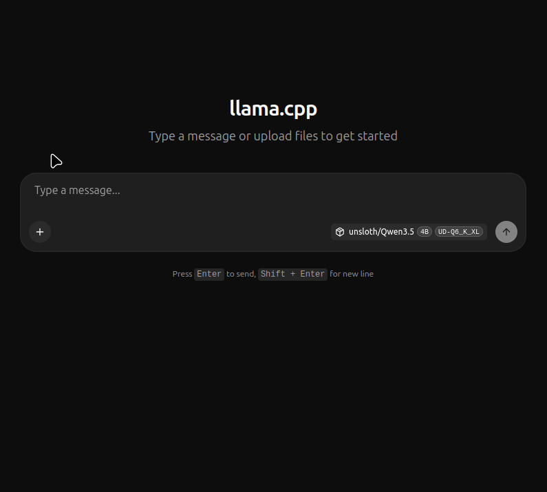
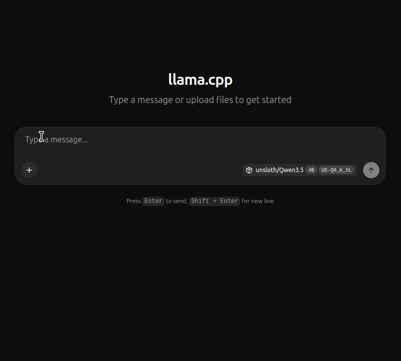

# Do It All MCP (diaMCP)

A versatile MCP server designed specifically for **llama.cpp webui** MCP integration. Simple to set up - just spin up the container and point your webui to the URL.

## Why diaMCP?

When using llama-server's webui, you want tools without complexity. No servers to manage, no configuration files to write. Just:

1. `docker compose up --build -d`
2. Add the MCP URL to your webui
3. Done.

## Installation

### Option 1: Quick Install (Recommended)

#### Linux / macOS
```bash
curl -fsSL https://raw.githubusercontent.com/chartrambiz/diaMCP/main/install.sh | sh
```

#### Windows
```powershell
irm https://raw.githubusercontent.com/chartrambiz/diaMCP/main/install.ps1 | iex
```

The script will:
- Check Docker and Docker Compose are installed
- Clone the repo if not present
- Build and start the container
- Show next steps

To update an existing installation, run the same command from within the diaMCP directory.

### Option 2: Git Clone

#### Linux / macOS
```bash
# Clone the repository
git clone https://github.com/chartrambiz/diaMCP.git
cd diaMCP

# Start the container
docker compose up --build -d
```

#### Windows (PowerShell)
```powershell
# Clone the repository
git clone https://github.com/chartrambiz/diaMCP.git
cd diaMCP

# Start the container
docker compose up --build -d
```

To update later:
```bash
git pull origin main 2>/dev/null || git pull origin master
docker compose up --build -d
```

## Windows Setup Requirements

If using Windows, you need:

1. **Docker Desktop for Windows**
   - Download from https://docker.com/products/docker-desktop
   - Requires Windows 10/11 Pro, Enterprise, or Education
   - Enable WSL2 backend during installation

2. **WSL2 (Windows Subsystem for Linux)**
   - Open PowerShell as Administrator and run:
     ```powershell
     wsl --install
     ```
   - Restart your computer when prompted
   - Ubuntu is recommended as your Linux distribution

3. **After WSL2 setup**
   - Open Ubuntu (or your chosen distro) from the Start menu
   - Run the installation commands above from within WSL2
   - All Linux/bash commands in this README will work as-is

**Note**: Running diaMCP directly in Windows Command Prompt or PowerShell (without WSL2) is not supported - the install scripts and container are designed for Linux environments.

## Post-Installation Setup

After starting the MCP server container:

1. Start llama-server with MCP proxy enabled:
```bash
llama-server --webui-mcp-proxy -m model.gguf -c 32768 --host 0.0.0.0 --port 8080
```

2. In the llama.cpp webui:
   - Go to MCP Settings
   - Toggle **"Enable llama-server proxy"** ON
   - Add the MCP URL: `http://localhost:8000/mcp`

The MCP tools will be available in your chat.

**Note:** Files created in the `workspace/` directory are owned by your user (UID 1000). If you need a different UID, edit `docker-compose.yml` and change the `user:` value.

## Updating

After modifying custom tools or pulling new changes, rebuild and restart:

```bash
./restart.sh
```

This script rebuilds the container and verifies it's running.

## Demo

See diaMCP in action with the llama.cpp webui:

### File Operations


### Web Search & Research


## Features

- **21+ Built-in Tools**: File operations, web search, git, shell, code execution, and more
- **Dangerous Command Blocking**: `run_command` blocks dangerous patterns (rm -rf, dd, mkfs, etc.)
- **Elicitation Support**: Confirmation prompts for risky commands (works with MCP clients that support it)
- **Dynamic Tool Discovery**: Drop Python files into `./workspace/tools/` or use built-in examples
- **HTTP Transport**: No stdio, no extra config - just a URL
- **Persistent Workspace**: Files and tools survive container restarts
- **Works with llama-server webui**: Designed for the MCP integration built into llama.cpp webui

## Tools

### File Operations
| Tool | Description |
|------|-------------|
| `read_file` | Read file contents |
| `write_file` | Write content to files |
| `list_directory` | List directory contents |
| `search_files` | Find files by glob pattern |
| `grep` | Search for patterns in files |
| `file_info` | Get file metadata (size, dates, permissions) |
| `delete_file` | Delete a file (with safety checks) |
| `create_directory` | Create directories |

### Web & Research
| Tool | Description |
|------|-------------|
| `web_search` | Search the web (DuckDuckGo) |
| `web_fetch` | Extract text from web pages |
| `download_file` | Download a file from URL to workspace |

### Git Operations
| Tool | Description |
|------|-------------|
| `git_clone` | Clone repositories |
| `git_pull` | Pull latest changes |

### System & Code
| Tool | Description |
|------|-------------|
| `run_command` | Execute shell commands (with dangerous pattern blocking) |
| `python_eval` | Run Python snippets |
| `run_python_script` | Execute Python script files |
| `get_system_info` | System information |
| `get_time` | Current date/time |
| `calculate` | Mathematical expressions |
| `count_lines` | Count lines of code by file type |

### Security Management
| Tool | Description |
|------|-------------|
| `manage_blacklist` | Add/remove commands from blacklist |
| `manage_approved` | List/clear approved commands |
| `get_dangerous_patterns` | Show blocked dangerous patterns |

### Custom Tools (./workspace/tools/)
| Tool | Description |
|------|-------------|
| `greeting` | Generate personalized greetings |
| `add_numbers` | Add two numbers |
| `word_reverser` | Reverse words in a sentence |

### Meta Tools
| Tool | Description |
|------|-------------|
| `create_tool` | Create a new tool dynamically (for LLMs) |

See [AGENTS.md](AGENTS.md) for detailed documentation on creating tools.

## MCP Resources

Resources expose context data that the LLM can read on demand:

| Resource | Description |
|----------|-------------|
| `diamcp://context/time` | Current date and time |
| `diamcp://context/system` | System information |
| `diamcp://workspace/summary` | Workspace contents overview |
| `diamcp://tools/list` | List of all available tools |

## MCP Prompts

Reusable prompt templates for common workflows:

| Prompt | Description |
|--------|-------------|
| `startup_context` | Call get_time and get_system_info first |
| `file_search_first` | Use search_files before reading files |
| `web_research` | Web search then fetch workflow |
| `code_review` | Steps for reviewing code |

## Adding Custom Tools

Create a Python file in `./workspace/tools/`:

```python
from base import tool

@tool(
    name="my_tool",
    description="What my tool does",
    schema={
        "type": "object",
        "properties": {
            "input": {"type": "string", "description": "Input"}
        },
        "required": ["input"]
    }
)
def my_tool(input: str) -> str:
    return f"Processed: {input}"
```

Restart the container to load new tools:
```bash
./restart.sh
```

## Configuration

### Environment Variables

| Variable | Default | Description |
|----------|---------|-------------|
| `MCP_HOST` | `0.0.0.0` | Host to bind to |
| `MCP_PORT` | `8000` | Port to listen on |

### Docker Compose

```yaml
services:
  diamcp:
    build: .
    ports:
      - "8000:8000"
    volumes:
      - ./workspace:/workspace
```

The workspace volume persists your files and custom tools across restarts.

## Architecture

```
diamcp/
├── server.py          # Main MCP server (FastMCP)
├── base.py            # Tool decorator & registry (copy to /app/tools/)
├── builtin.py         # Built-in tools (copy to /app/tools/)
├── tools/             # Internal diaMCP tools (copied to /app/tools/)
│   ├── examples/      # Reference examples - copy to workspace/tools/ to use
│   │   ├── useful_tools.py
│   │   ├── weather_tool.py
│   │   └── example_tools.py
├── install.sh         # One-line install/update script (Linux/macOS)
├── install.ps1        # One-line install/update script (Windows)
├── restart.sh         # Rebuild and restart script
├── config/            # Configuration
├── Dockerfile
├── docker-compose.yml
├── requirements.txt
└── workspace/         # Persistent volume (mounted at /workspace)
    └── tools/         # Your custom tools go here
```

## Tool Locations

| Location | Purpose | Persists? |
|----------|---------|-----------|
| `tools/` | Built-in diaMCP tools | No - internal to container |
| `tools/examples/` | Reference examples | No - copy to workspace to use |
| `workspace/tools/` | Your custom tools | Yes - survives updates |

To use an example tool, copy it from `tools/examples/` to `workspace/tools/`, then run `./restart.sh`.

## Requirements

- Docker
- Docker Compose
- llama.cpp webui with MCP support (`--webui-mcp-proxy` flag on llama-server)

## License

MIT License - see LICENSE file for details.
